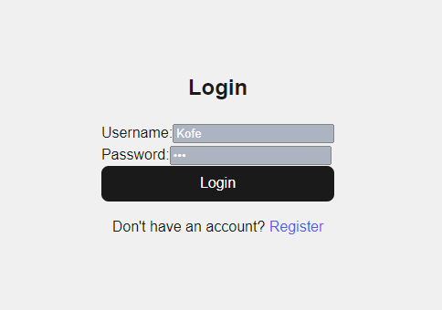
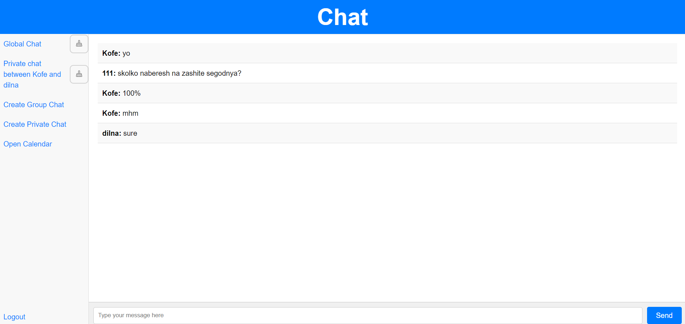
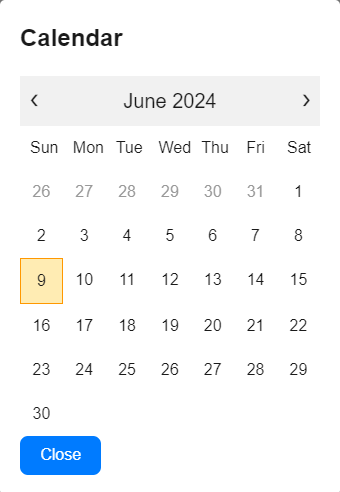
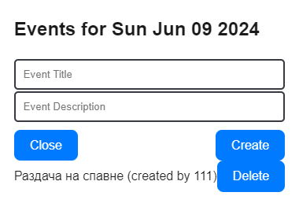
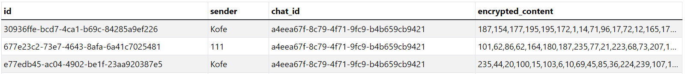

# Secure Chat Application

This is a secure real-time chat application developed by **Dilnaz S.**, **Arlan M.**, and **Islam A.**. It utilizes Flask for the backend and React for the frontend, with real-time communication implemented via Flask-SocketIO and message encryption using AES.

## Table of Contents

- [Introduction](#introduction)
- [Features](#features)
- [System Architecture](#system-architecture)
- [Installation](#installation)
- [Usage](#usage)
- [APIs](#apis)
- [Security Features](#security-features)
- [Database Management](#database-management)
- [Real-Time Communication](#real-time-communication)
- [Contributors](#contributors)

## Introduction

This chat application focuses on providing a secure and seamless messaging experience. Messages are encrypted with AES, and the system manages sessions securely using Flask-Session. The app supports real-time messaging, ensuring instant communication between users.

## Features

- User registration and login with secure password storage
- Real-time communication using Flask-SocketIO and WebSockets
- AES encryption for secure messaging
- Responsive frontend built with React
- RESTful APIs for seamless client-server communication
- Database management using SQLite

## System Architecture

The application follows a client-server architecture with distinct frontend and backend components.

### Backend:
- **Framework**: Flask
- **Database**: SQLite
- **Real-Time Communication**: Flask-SocketIO (WebSockets)
- **Session Management**: Flask-Session for server-side session storage

### Frontend:
- **Framework**: React
- **State Management**: React Hooks and Context API
- **Communication**: Axios for HTTP requests, Socket.IO for WebSocket connections

## Screenshots

Here are some screenshots of the application:

### 1. Login Page


### 2. Chat Interface


### 3. Calendar
<div width="600">
    
    
</div>

### 4. Encrypted Message View (Backend)



## Installation

1. Clone the repository:

    ```bash
    git clone https://github.com/kooofe/DiplomaFlask/tree/main
    ```

2. Navigate to the backend folder:

    ```bash
    cd backend
    ```

3. Install the required Python packages:

    ```bash
    pip install -r requirements.txt
    ```

4. Navigate to the frontend folder:

    ```bash
    cd ../react-app
    ```

5. Install the necessary Node.js packages:

    ```bash
    npm install
    ```

## Usage

1. Start the backend server:

    ```bash
    npm run
    ```

2. Start the frontend server:

    ```bash
    npm start
    ```

3. Access the application at `http://localhost:3000`.

## APIs

The application provides several RESTful API endpoints for user management and message retrieval.

| **Endpoint**         | **Description**                                                                                 |
|----------------------|-------------------------------------------------------------------------------------------------|
| `/register`          | Registers a new user with a hashed password stored in the SQLite database.                       |
| `/login`             | Authenticates a user by verifying their credentials and creating a session.                      |
| `/logout`            | Logs out the user by terminating their session.                                                  |
| `/messages`          | Retrieves and decrypts messages from the SQLite database for the user.                           |

## Security Features

### User Authentication

- Passwords are hashed using `werkzeug.security` before being stored in the SQLite database.
- User sessions are managed using Flask-Session, storing session data on the server for enhanced security.

### Message Encryption

- Messages are encrypted using AES (Advanced Encryption Standard) before being stored in the database.
- Upon retrieval, messages are decrypted on the server before being displayed to the user.

### Real-Time Communication

- WebSocket connections are established using Flask-SocketIO for real-time communication.
- Messages are transmitted over WebSockets and encrypted before being sent.

## Database Management

The application uses SQLite for managing user credentials and chat messages.

### Database Schema:

- **User Table**: Stores the username and hashed password for each user.
- **Message Table**: Stores encrypted messages, along with sender, receiver, and timestamp information.

## Real-Time Communication

- The application uses Flask-SocketIO for handling real-time messaging.
- WebSocket connections allow messages to be transmitted instantly between clients.
- Messages are encrypted with AES before being sent and decrypted on the server.

## Contributors

- **Dilnaz S.**
- **Arlan M.**
- **Islam A.**
